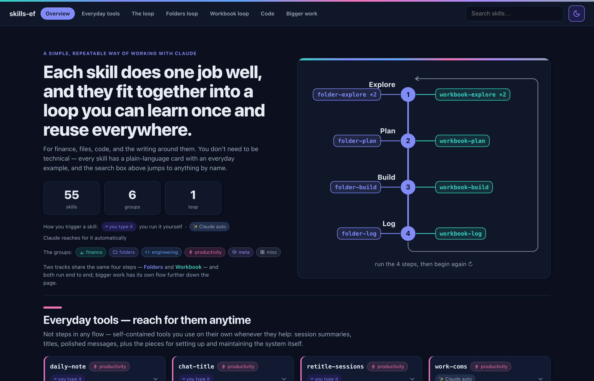

# skills-ef guide

The interactive guide to [ethanfoell/skills](https://github.com/ethanfoell/skills): agent skills for Claude that apply engineering discipline to a financial analyst's work, for finance, files, code and the writing around them.

**Live at <https://ethanfoell.github.io/skills-ef-guide/>.**

## What it is

One page, no install. Every skill in the set has a plain-language card with an everyday example, the groups and the loop are laid out so a non-technical reader can see how the pieces fit, and the search box jumps to any skill by name. Read it to decide whether the skills are for you, then install them from the [skills repo](https://github.com/ethanfoell/skills#install).

## How this repo works

This repo is the production copy of the guide, served by GitHub Pages from `main`. The page is generated, not hand-written: its source and build live with the skills, and each release of the skills exports a finished `skills-ef-guide.html` under [`docs/site/`](https://github.com/ethanfoell/skills/tree/main/docs/site) in that repo. Promoting a release means copying that file here as `index.html`. There is nothing to build in this repo, and `index.html` is never edited by hand.

## License

[MIT](./LICENSE).
